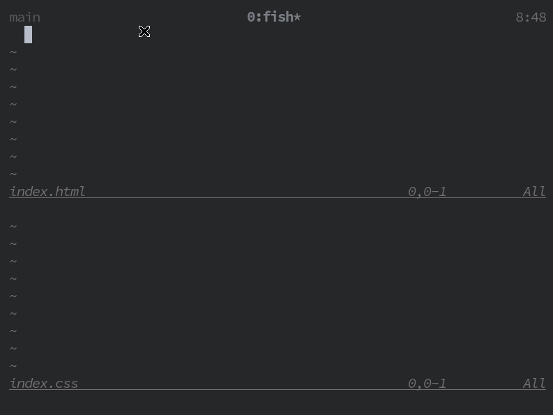

# emmet-ls

Emmet support based on LSP.  
Started as [coc-emmet](https://github.com/neoclide/coc-emmet) replacement for [completion-nvim](https://github.com/nvim-lua/completion-nvim). Should work with any lsp client but not tested.




#### Install
```
npm install -g emmet-ls
```

#### Configuration 

##### Example Configuration

With [nvim-lspconfig](https://github.com/neovim/nvim-lspconfig):

```lua
local lspconfig = require('lspconfig')
local configs = require('lspconfig/configs')
local capabilities = vim.lsp.protocol.make_client_capabilities()
capabilities.textDocument.completion.completionItem.snippetSupport = true

lspconfig.emmet_ls.setup({
    -- on_attach = on_attach,
    capabilities = capabilities,
    filetypes = { 'html', 'typescriptreact', 'javascriptreact', 'css', 'sass', 'scss', 'less' },
})
```

##### Supported Filetypes

- `html`, `typescriptreact`, `javascriptreact`, `css`, `sass`, `scss` and `less` filetypes are fully supported.
- Any other filetype is treated as `html`.
